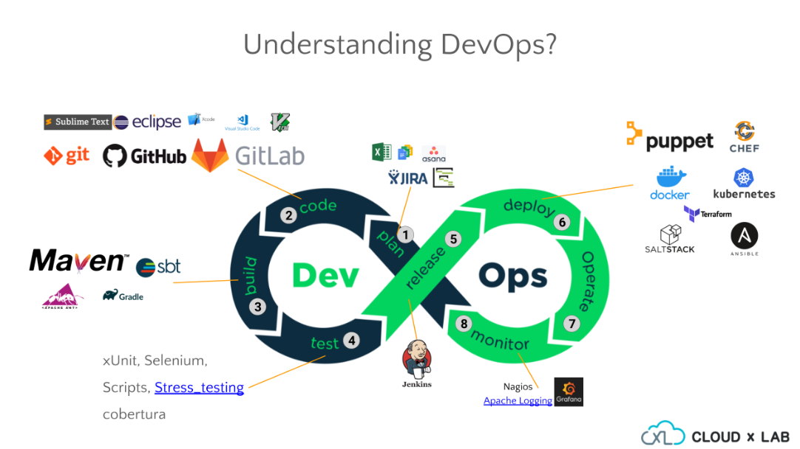

# LỘ TRÌNH HỌC DEVOPS (2025 UPDATE)

Mục tiêu cuối: Biết triển khai, giám sát, tự động hóa và vận hành toàn bộ hệ thống phần mềm từ code đến production.

## Giai đoạn 1: Nền tảng hệ thống (System Fundamentals)

Trước khi “làm DevOps”, phải hiểu hệ thống hoạt động thế nào.

**Học:**

- Hệ điều hành Linux (Ubuntu, CentOS, Debian)

  - Lệnh cơ bản: `ls`, `cd`, `chmod`, `chown`, `ps`, `top`, `grep`, `awk`, `sed`
  - Cấu trúc thư mục Linux (/etc, /var, /home, /usr)
  - Quyền user, group, sudo
  - Dịch vụ (service), process, log system

- Networking cơ bản

  - TCP/IP, DNS, DHCP, HTTP/HTTPS
  - Cổng (port), IP, subnet
  - ping, netstat, curl, traceroute

- SSH & SCP

  - Tạo key, kết nối từ xa, copy file.

- Bash scripting

  - Viết script tự động (backup, deploy, check status, crontab,...)

**=> Mục tiêu: Có thể thao tác, cấu hình, fix lỗi hệ thống Linux như một admin.**

## Giai đoạn 2: Version Control – Git & GitHub/GitLab

**Học:**

- Cách dùng Git cơ bản:

  - `init`, `clone`, `add`, `commit`, `push`, `pull`

- Nhánh (branch), merge, rebase

- Resolve conflict

- `.gitignore`, tag, release

- GitHub Actions (sau này dùng cho CI/CD)

**=> Mục tiêu: Làm việc nhóm, kiểm soát source code, CI/CD pipeline cơ bản.**

## Giai đoạn 3: Ngôn ngữ lập trình và tự động hóa

Không cần thành dev, nhưng cần biết viết script để tự động hóa.

**Học:**

- Python, JavaScript, C/C++,.. (phổ biến nhất cho DevOps)

  - Xử lý file, subprocess, request API, automation

- (Tuỳ chọn) Shell script nâng cao

**=> Mục tiêu: Có thể viết tool deploy, kiểm tra service, tự động backup, gửi thông báo Slack, v.v.**

## Giai đoạn 4: Containers – Docker & Containerization

**Học:**

- Docker concepts:

  - Image, Container, Volume, Network

- Viết Dockerfile

- Quản lý container: docker run, docker ps, docker exec, docker-compose

- Tạo multi-container app bằng Docker Compose

**=> Mục tiêu: Đóng gói ứng dụng, môi trường dev/test/production đồng nhất.**

## Giai đoạn 5: Orchestration – Kubernetes (K8s)

**Học:**

- Core concepts:

  - Pod, Deployment, Service, Ingress, ConfigMap, Secret

- YAML config

- Quản lý cluster (kubectl)

- Helm chart

- Minikube / k3s (để học local)

**=> Mục tiêu: Biết triển khai & scale ứng dụng container trên cluster lớn.**

## Giai đoạn 6: CI/CD – Continuous Integration / Delivery

**Học:**

- Jenkins / GitLab CI / GitHub Actions

- Tự động build & deploy ứng dụng

- Pipeline stages: build → test → deploy

- Webhook, artifact, rollback

**=> Mục tiêu: Code mới được tự động test, build, deploy không cần thao tác tay.**

## Giai đoạn 7: Infrastructure as Code (IaC)

**Học:**

- Terraform – quản lý hạ tầng bằng code (AWS, Azure, GCP)

- Ansible – tự động cấu hình server (install package, deploy app)

- CloudFormation (AWS) – tùy chọn

**=> Mục tiêu: Có thể setup toàn bộ hệ thống cloud bằng code, không click thủ công.**

## Giai đoạn 8: Cloud Platform

**Học:**

- AWS (phổ biến nhất):

  - EC2, S3, IAM, VPC, RDS, CloudWatch, ECS, Lambda

- Hoặc Azure / GCP

- Triển khai app thực tế trên cloud

**=> Mục tiêu: Biết triển khai hệ thống thật trên môi trường cloud production.**

## Giai đoạn 9: Monitoring & Logging

**Học:**

- Prometheus + Grafana → monitor CPU, RAM, service

- ELK Stack (Elasticsearch + Logstash + Kibana)

- Alerting (qua Slack, email)

**=> Mục tiêu: Theo dõi và cảnh báo khi hệ thống có vấn đề.**

## Giai đoạn 10: Security & Optimization

**Học:**

- SSL/TLS, HTTPS, Firewall (ufw, iptables)

- Docker image security

- Cloud IAM & secrets management

- Backup, disaster recovery

- Performance tuning

**=> Mục tiêu: Biết bảo vệ & tối ưu hệ thống.**

## Giai đoạn 11: Thực hành dự án thật (Final Stage)

Làm các project nhỏ:

Deploy web app bằng Docker + Jenkins + AWS

CI/CD pipeline: push code → auto build Docker → deploy lên K8s

Monitor bằng Prometheus + Grafana

Quản lý hạ tầng bằng Terraform

**=> Mục tiêu: Có portfolio, phỏng vấn DevOps tự tin.**
