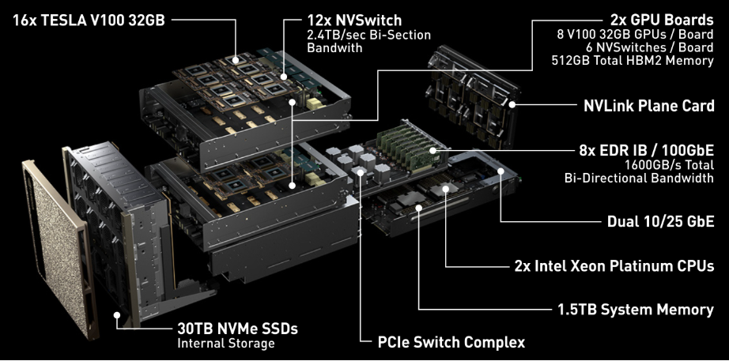
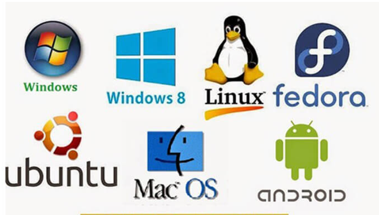
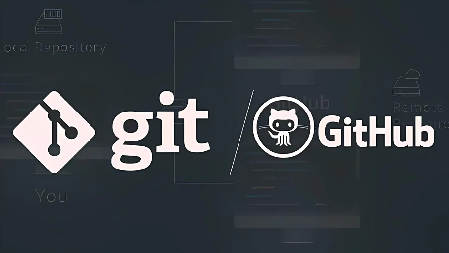
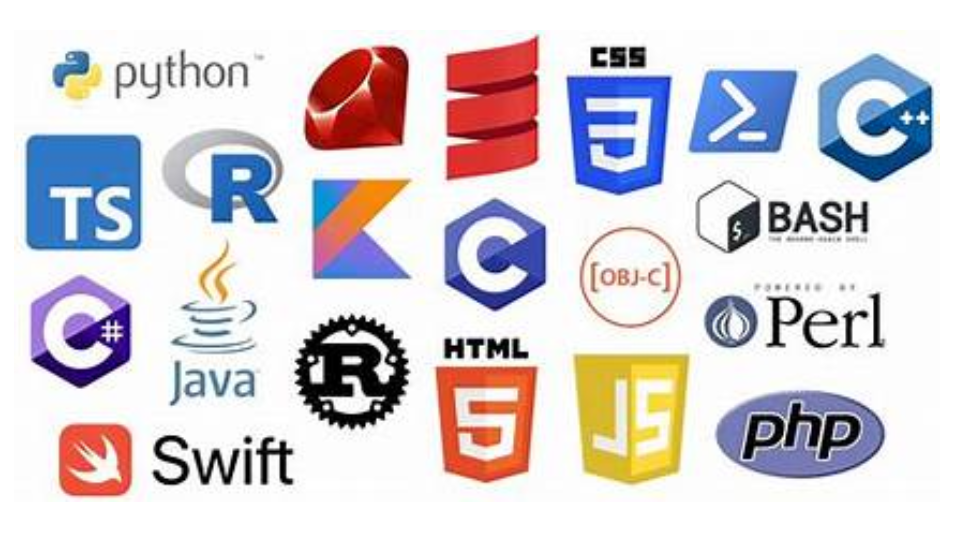
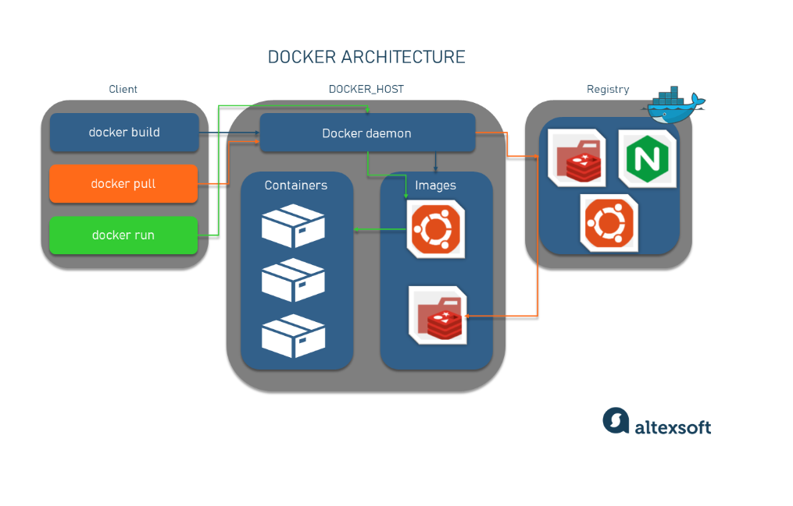
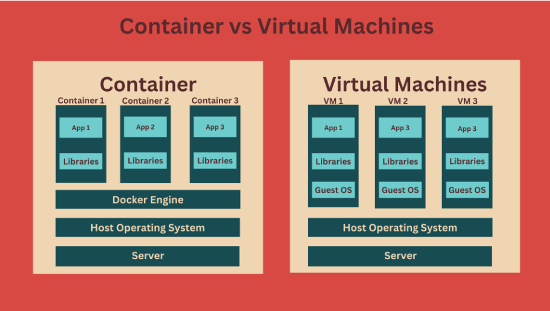
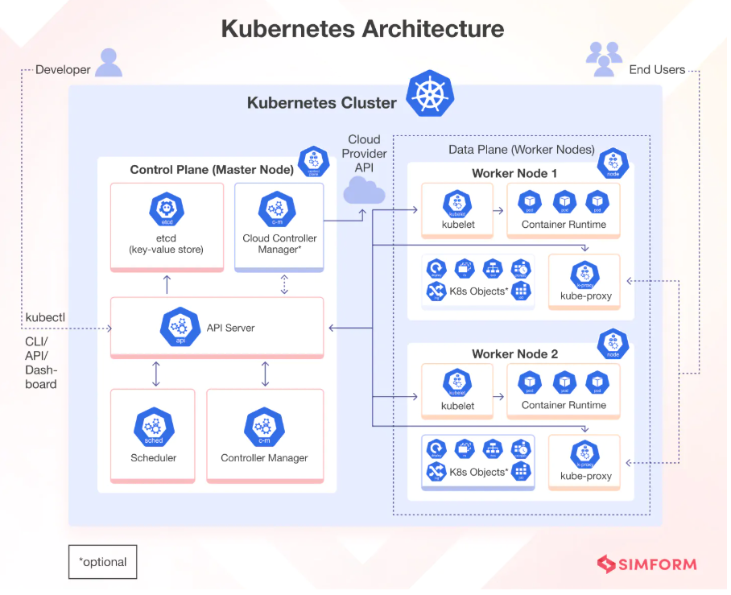
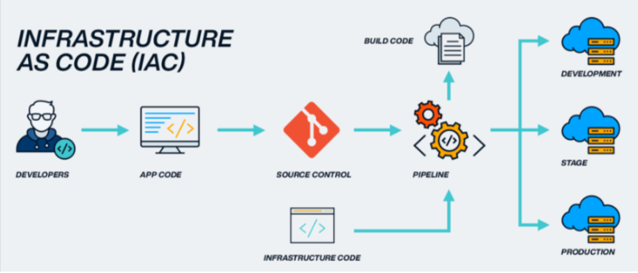
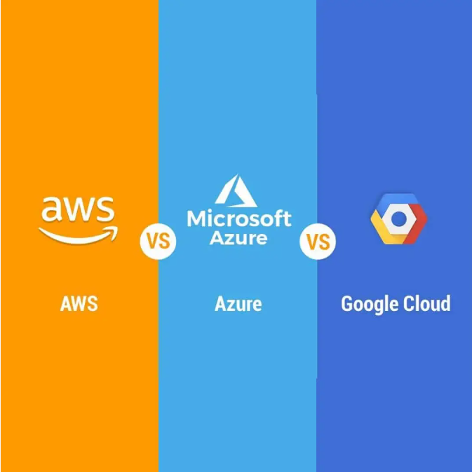
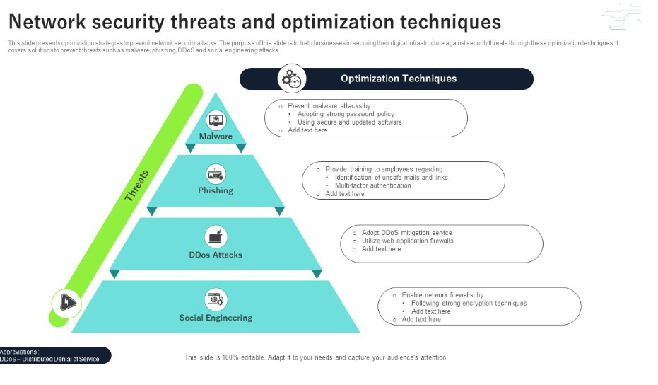

# MY OWN DEV OP ROAD MAP

Lộ trình học Dev Op này dựa trên lộ trình tìm hiểu phù hợp với cá nhân mình cho lên mọi người có thể học dựa theo hoặc có thể bổ sung chỉnh sửa thêm cho tài liệu của các bạn. Tài liệu này cũng không chắc chắn 100% là đúng lên mọi người thấy có sai thông cảm phát nhé :3

## I. STEP 1: TÌM HIỂU SYSTEM FUNDAMENTALS (Nền tảng hệ thống )

**Mục tiêu**: Biết được máy tính, hệ điều hành, và mạng thật sự hoạt động ra sao.

### 1. Tìm hiểu về kiến trúc máy tính (Computer Architecture)

  

- Tìm hiểu cấu trúc cơ bản nhất của 1 máy tính cần có ?
  
  - Cơ bản chỉ cần 5 thành phần: **CPU** (Central Processing Unit ), **Memory** (RAM), **Storage** (HDD,SDD), **I/O**(Input/Output Devices), **Bus System**. Tìm hiểu chúng ?
  - Tìm hiểu về **Binary** & **Assembly basics**
  - Tìm hiểu **ALU**, **CLU**, **Register**, **Cache**, **Cluster**
  - Tìm hiểu mở rộng thêm: **Disk**; **BIOS/UEFI**; **Boot process** or **Boot Loader** là gì ?
  - Nguyên lí hoạt động của 1 máy tính (Chu trình vòng lặp **Fetch**->**Decode**->**Excute**->**Repeat**)
  - Tìm hiểu sơ qua về I/O Devices
  - So sánh **Firmware** vs **Kernel** vs **OS** (Ranh giới rõ ràng giữa từng tầng). Tìm hiểu về các liệu **Firmware**
  - Tìm hiểu về các đơn vị GHz, Công nghệ sản xuất Chip hiện nay tới đâu và phân loại các loại máy tính phổ biến hiện nay (Máy chủ Sever or máy tính train AI, máy tính đa lõi ...)?
  - Tìm hiểu GPU khác gì so với CPU?
  - Ngoài GPU, CPU còn chip gì nữa?
  
- Lab (Thực hành):
  
  - Cài Linux từ USB và xem log khởi động (`dmesg`).
  - Dùng `lscpu`, `lsblk`, `lspci` để hiểu phần cứng.
  - Viết một chương trình Assembly nhỏ để thao tác với CPU register.

- Tìm hiểu sơ qua về máy tính AI or các GPU train AI

  - Ví dụ: Siêu máy tính DGX-2 của NVDIA là máy tính thiết kế tối ưu dành cho việc huấn luyện các mô hình AI và các mô hình LLM (Ngôn ngữ lớn) dành cho GROK của tỷ phú Elon Musk or GPT của Open AI

  

### 2. Tìm hiểu OS - Hệ điều hành (Operating System)

**Mục tiêu**: Biết được cách OS quản lý process, memory, file system, permission, user/group và hiểu OS ở mức độ `Senior - Level`



- Tìm hiểu chung OS là gì ?

- Tìm hiểu về 2 OS đó là : Window, Linux ?

- Tìm hiểu về các Distro trong Linux ? (Ubuntu,CentOS9)

- Tìm hiệu cách vận hành OS ở mức độ `Junior`:

  - Lệnh cơ bản: `ls`, `cd`, `chmod`, `chown`, `ps`, `top`, `grep`, `awk`, `sed`
  - Cấu trúc thư mục Linux (/`etc`, `/var`, `/home`, `/usr`)
  - Quyền `user`, `group`, `sudo` hay **permission**
  - Dịch vụ (service), process, log system  
  
  => Mục tiêu:
  
  - Tự **deploy app** trên Linux server.
  - Tự xử lý khi web hoặc service **chết**.
  - **Đọc log** để tìm nguyên nhân.

- Tìm hiểu & thực hành debug OS and optimize container và pipeline CI/CD ở cấp `Middle - level`:

  - Tìm hiểu **Process scheduling**:Hiểu CPU time, load average, context switch ?
  - Tìm hiểu **Memory management**: Cache, swap, virtual memory, OOM killer ?
  - Tìm hiểu **File system internals**: Inode, journaling, disk I/O, iostat, df, du ?
  - Tìm hiểu **System calls & Kernel space**: Biết cách đọc syscall qua strace ?
  - Tìm hiểu **System performance tuning**: ulimit, sysctl, vm.swappiness, nice, cgroups ?
  - Tìm hiểu **Init process & Boot flow**: Từ BIOS → kernel → systemd → service ?
  - Tìm hiểu **Networking stack**: Socket, TCP connection state, net namespace ?
  - Tìm hiểu **Container isolation** (namespace, cgroups): Hiểu cách Docker cô lập tiến trình ?
  - Thực hành theo dõi tài nguyên bằng `top`, `vmstat`, `iotop`, `sar`, `pidstat`.
  - Thực hành **Debug app** chết do **OOM hoặc CPU spike**.
  - Thực hành **Điều chỉnh kernel param** để tăng performance.
  - Thực hành Hiểu vì sao container chạy “như process”.  
  
  => Mục tiêu:
  
  - Biết vì sao hệ thống **chậm**, không chỉ biết **restart** lại là xong.
  - Có thể tối ưu **máy chủ**, **container**, **và pipeline CI/CD** ở cấp OS.

- Tìm hiểu & Thực hành để touch core Kernel and deep optimize trong môi trường Cloud lớn

  - Tìm hiểu **Kernel tuning sâu**: Để hiểu CPU governor; NUMA; hugepage; IRQ affinity ?
  - Tìm hiểu **eBPF & tracing**: Để theo dõi kernel runtime, network tracing ?
  - Tìm hiểu **Scheduler & cgroups v2**: Để tối ưu container scheduling ?
  - Tìm hiểu **Security model**: Để SELinux, AppArmor, capabilities ?
  - Tìm hiểu **Custom kernel build**:Để biết build hoặc patch kernel nếu cần (hiếm) ?
  - Thực hành **Debug lỗi kernel panic** trong production.
  - Thực hành theo dõi **container và network** ở mức `kernel`.
  - Thực hành làm việc với **team kernel hoặc infra core**.

### 3. Tìm hiểu hiểu về Command line (Cụ thể là `Bash`)

- Mức `Basic - Level`:
  
  - `cd`, `ls`, `mv`, `cp`, `rm`
  - `cat`, `less`, `head`, `tail`
  - `mkdir`, `chmod`, `chown`
  - systemctl start/stop/restart
  - apt/yum/dnf install
  - `ssh`, `scp`
  - `nano`, `vim` (ít nhất biết mở & lưu)

- Mức `Middle - Level`:

  - Quản lý file & text

    - `grep` nâng cao (regex)
    - `find` + `exec`
    - `sed` (replace text)
    - `awk` (xử lý text column-based)

  - Quyền hạn & user

    - `useradd`, `passwd`
    - `su`, `sudoers`
    - `sticky bit`, `setuid`, `setgid`

  - Quản lý process

    - `ps -ef`
    - `top`, `htop`
    - `kill`, `pkill`
    - `nice`, `renice`

  - Networking

    - `ifconfig` / `ip addr`
    - `ip route`
    - `ping`, `traceroute`, `dig`, `nslookup`
    - `netstat` / `ss`
    - `curl`, `wget`

  - Nén – đóng gói

    - `tar`, `gz`, `zip`, `unzip`
    - `rsync`

- Mức `Senior -Level`:

  - Shell scripting (bắt buộc giỏi)

    - biến (variables)
    - function
    - pipe, redirection
    - subshell
    - arrays
    - error handling (`set -e`, `trap`)
    - logging
    - cron jobs automation

  - Performance & troubleshooting

    - đọc log hệ thống: `journalctl`
    - phân tích memory: `free`, `vmstat`, `/proc/meminfo`
    - phân tích CPU: `mpstat`, `sar`
    - phân tích I/O: `iostat`
    - phân tích network: `tcpdump`, `ngrep`

  - Filesystem & Disk management

    - `mount`, `umount`
    - ext4/xfs/btrfs basics
    - `lsof`
    - `df`, `du`
    - LVM (`pvcreate`, `vgcreate`, `lvcreate`)
  
- Mức `Lead - Level`:

  - `Automation`

    - **viết script** tự **deploy app**
    - **script backup/restore**
    - **script monitor service**
    - **script auto restart khi service chết**

  - Tích hợp với DevOps tools

    - Command line mày sẽ dùng để thao tác:

      - `Docker CLI`
      - `Kubernetes CLI` (kubectl)
      - `Git CLI`
      - `Terraform CLI`
      - `Ansible CLI`
  
  => Mục tiêu: mức **admin hệ thống** + **scripting** + **troubleshooting**.

  - DevOps = 70% command line + 30% tool GUI.

### 4. Tìm hiểu về Networking (CCNA + ≈CCNP)


Dev-Op cần nắm rõ kiến thức Networking ở mức CCNA và ≈ mức chứng chỉ CCNP

- **Tìm hiểu CCNA ?**

- Tìm hiểu **CCNP** những kiến thức sau:

  - IP routing core (vừa đủ)

    - **Static route**
    - **OSPF** basic
    - **BGP** khái niệm + cách hoạt động
    - **Không cần học full CCNP** routing như **redistribution, route reflector, complex topology**.

  - Network troubleshooting

    - Traceroute / mtr
    - Path MTU
    - Packet flow
    - Tcpdump
    - Firewall rules logic
    - TCP handshake
    - Latency, jitter, drops

  - Load balancing concepts

    - L4 vs L7
    - NAT, PAT
    - DNAT / SNAT
    - TCP vs UDP
    - session persistence

  - Network security basic

    - ACL logic
    - Firewall concept
    - VLAN segmentation
    - VPN basic (IPSec)

  - IPv6 basic

    - Trong cloud (AWS, Azure, GCP) rất hay gặp IPv6.

- Lưu ý không tìm hiểu quá kĩ những phần sau (Có thể đọc hiểu nếu muốn):

  - EIGRP full
  - OSPF multi-area phức tạp
  - MPLS
  - DMVPN
  - QoS chi tiết theo từng DSCP
  - Wireless
  - Switching sâu (STP, RSTP, MSTP)

  => Mục tiêu: DevOps cần networking mức “hiểu để vận hành hệ thống lớn + debug sự cố nhanh”.

## II. STEP 2: TÌM HIỂU VỀ VERSION CONTROL - GIT & GIT HUB/GIT LAB



**Mục tiêu**:

- Có thể làm mọi thao tác Git cần thiết (`clone`, `branch`, `merge`, `rebase`, `revert`) hàng ngày.

- Thiết kế **Workflow team** (GitHub Flow / GitLab Flow / trunk-based).

- Tích hợp **repo** với **CI/CD, secrets, và policies** (protected branches, required reviews).

- Áp dụng **GitOps** để **deploy infra/app** vào **Kubernetes (ArgoCD/Flux)**.

- Biết **debug, recover** (reset, reflog, fsck), **quản trị server-side** (backup, hooks, access control).

**Nhiệm vụ**:

- Tìm hiểu khái niệm tất cả khái niệm về **Git** ?(Từ GitLab, GitHub, GitOps, VSControl)

- Tìm hiểu khái niệm `Basic` như snapshot, commit, branch; chạy workflow cá nhân

    - Cài Git, config user/email:

      - `git config --global user.name "Your Name"`
      - `git config --global user.email you@domain.com`

    - Học lệnh`Init`/`clone`/`add`/`commit`/`push`/`pull`:

      - git init / git clone <url>
      - git add . → git commit -m "msg" → git push origin main

    - Branch & merge cơ bản:

      - `git branch feature/x` → `git checkout feature/x` (hoặc `git switch -c feature/x`)
      - Merging: `git checkout main` → `git merge feature/x`

    - Làm bài tập: tạo repo cá nhân, implement feature trên branch, merge về main, đẩy lên GitHub.

- Tìm hiểu về **WorkFlow & Collaboration**: dùng Pull Request / Merge Request, code review, branching strategy.

  - Hiểu **GitHub Flow** vs **GitLab Flow** vs **Trunk-based**. Chọn 1 cho dự án.
  - Tạo PR/MR, làm review, resolve conflict trên PR.
  - Protected branches, required CI, reviewers — cấu hình trên `Git hosting`.
  - Làm bài tập: mô phỏng team 3 người — one repo, mỗi người 1 branch, dùng PR để review + merge.

- Tìm hiểu cách xử lý merge conflict, `rebase`, interactive rebase, `stash`, `cherry-pick`, `revert`, `reset`.

  - `git rebase` (interactive): gộp/sửa commit trước khi push.
    - `git rebase -i HEAD~5`
  - `git stash` to save changes temporarily.
  - `git cherry-pick <commit>` để lấy commit từ branch khác.
  - `git revert <commit>` để tạo commit đảo ngược (safe for shared history).
  - `git reset --hard <commit>` (cẩn thận — destructive).
  - Làm bài tập: tạo tình huống conflict, resolve; thực hành `rebase -i` để chỉnh lịch sử commit; dùng `reflog` để recover.

- Tìm hiểu Object model, refs, index, plumbing vs porcelain — để debug repo lớn, tối ưu, sửa lỗi hỏng(**Git Internals & Low-level**)

  - Đọc Git internals (objects: blobs, trees, commits, tags).
  - Tìm hiểu `.git/` structure (`HEAD`, `refs/`, `objects/`,`index`).
  - Dùng plumbing commands: `git cat-file -p`, `git hash-object`, `git update-index`, `git fsck`.
  - Khôi phục với `git reflog`, `git fsck --lost-found`.
  - Làm bài tập: tạo vài commit, xóa bằng `reset`, recover bằng `reflog`; inspect objects bằng `git cat-file`.

- Tìm hiểu quản trị repo, access control, hooks, backup, runner/agents integration.(Severside,Host & Admin)

  - Chọn 1 hosting: GitHub, GitLab, Bitbucket — biết cấu hình repo, webhooks, protected branches.
  - Git server basics (SSH keys, deploy keys, tokens), mirror/backup repos.
  - Git hooks: `pre-commit`, `pre-receive`, `post-receive` — viết hook để enforce lint/tests.
  - LFS (Large File Storage) cho binary.
  - Làm Bài tập: tạo GitLab repo, tạo runner, cấu hình webhook deploy (ví dụ trigger simple script on push).

- Tìm hiểu cách tích hợp CI/CD (Từ commit → test → build → deploy tự động)

  - Viết pipeline cơ bản (`.gitlab-ci.yml`, `github-actions.yml`) — stages: build → test → deploy.
  - Secrets & tokens: lưu an toàn (GitHub Secrets / GitLab CI variables).
  - Artifacts & caching để tăng tốc pipeline.
  - Triggers, scheduled pipelines, manual jobs.
  - Làm bài tập: pipeline test + build docker image → push lên registry → deploy lên staging.

- Tìm hiểu cách làm chủ GitOps pattern — Git là source-of-truth cho infra; tự động deploy vào K8s:

  - Khái niệm GitOps (pull-based): repo chứa manifests/Helm/Kustomize.
  - Cấu hình Argo CD hoặc Flux: sync repo → apply changes → rollback dễ dàng.
  - Làm bài tập: tạo repo chứa k8s manifests, setup ArgoCD để auto-deploy khi push; thử rollback bằng revert commit.

- Tìm hiểu cách xử lý monorepos, submodules, mono vs multi-repo, performance, security.

  - Submodules vs subtrees. Khi dùng monorepo, dùng `git sparse-checkout`.
  - Scaling: shallow clone, partial clone, Git LFS, repo GC.
  - Security: signed commits (`git commit -S`), verify tags, branch protection, dependency scanning.
  - Disaster recovery: `git clone --mirror`, backup strategy, `git fsck`.

### III. STEP 3: HỌC NGÔN NGỮ LẬP TRÌNH VÀ TỰ ĐỘNG HOÁ



**Mục Tiêu**: Có thể viết tool deploy, kiểm tra service, tự động backup, gửi thông báo Slack, v.v.

**Nhiệm vụ**:

- Tìm hiểu về 7 loại ngôn ngữ `C`, `C++`, `C#`, `Python`, `JavaScripts`, `Java`

- So sánh mục đích của 7 loại ngôn ngữ đó và môi trường chúng thường làm việc

- Học OOP + Cấu trúc dữ liệu + Lập trình hướng đối tượng

- Chú trọng học các loại ngôn ngữ:

  - **Python** (quan trọng nhất)

    - Automation
    - Scripting

  =>**Ansible, boto3, kubernetes client, CLI tools**

  - **JavaScript/NodeJS**

    - Viết tool CLI
    - Serverless cloud functions

  - **Java hoặc C#** (tùy stack công ty)

    - Build backend
    - CI/CD pipeline

  =>Microservice ecosystem

  - **C & C++** → KHÔNG CẦN CHO DEVOPS

  =>Chỉ cần hiểu để đọc log system hoặc build too

- Học cách viết shell script và cron tab nâng cao bằng ngôn ngữ **Python** thay vì **Bash** đối với 1 số shell script có độ phức tạp cao

### IV. STEP 4: TÌM HIỂU VỀ CONTAINERS - DOCKER

<p align="center">
  
  
</p>

Dưới đây là lộ trình học **Containers – Docker – Containerization** chuẩn DevOps Engineer, có phân cấp độ `Beginner` → `Mid Level` → `Senior`, và từng mục cụ thể cần học để đủ dùng trong thực chiến DevOps.

**Mục tiêu:**

- Hiểu cách container hoạt động → **namespaces, cgroups**
- Biết build image chuẩn (**multi-stage, tối ưu size**)
- Biết quản lý **container + network + volume**
- Biết viết Dockerfile tốt
- Biết **push/pull** image registry (DockerHub, Harbor, ECR…)
- Hiểu cách container chạy trong Kubernetes

**Nhiệm vụ:**

`Beginner Level`

- **Container** là gì?

  - Sự **khác nhau** giữa **VM và container**

    - **Namespaces**
    - **cgroups**
    - Các **engine container**: **Docker, Podman, Containerd**

- Cách cài **Docker** trên **Linux**

  - **Install Docker Engine**
  - **Docker daemon**
  - **docker CLI**

- Các lệnh Docker cơ bản: `docker pull`, `docker run`, `docker stop`, `docker rm`, `docker ps -a`, `docker logs`, `docker exec -it`, `docker inspect`.

- **Image & registry**

  - Image là gì?
  - Layer trong image
  - **DockerHub**
  - **Local registry**

- **Dockerfile** cơ bản

  - Cần nắm:

    - `FROM`
    - `RUN`
    - `COPY / ADD`
    - `WORKDIR`
    - `CMD / ENTRYPOINT`
    - `ENV`
    - `EXPOSE`

- Build image

```bash
docker build -t myapp:1.0 .
```

`Mid Level`

- Docker network

  - Hiểu và dùng:
`
    - `bridge`
    - `host`
    - `none`
    - `overlay` (Swarm/K8s related)

  -> Biết container giao tiếp nhau như nào.

- Docker volumes

  - `bind mount`
  - `named volume`

  ->lưu trữ dữ liệu database

- **Multi-stage build**

  - Tối ưu image (rất quan trọng):

    - **giảm size**
    - **tăng bảo mật**
    - **build → runtime phase**

- **Best practices** trong **Dockerfile**

  - Không chạy app bằng `user root`
  - Không copy cả project, dùng `.dockerignore`
  - Dùng base image **tối ưu (alpine, slim, distroless)**
  - **Version pinning**

- **Docker Compose** (cực quan trọng)

  - Phải biết:

    - `docker-compose.yml`
    - **multi-container app**
    - **environment variables**
    - **healthcheck**
    - **depends_on**

  ->DevOps dùng **Compose** rất nhiều để mô phỏng **microservices local**.

`Senior level`

Không bắt buộc khi mới vào nghề, nhưng rất mạnh.

- **Container runtime**(Biết Docker chỉ là 1 runtime)
  
  - Hiểu:

    - containerd
    - CRI-O
    - OCI specs

- Deep dive vào container

  - namespace: `pid`, `mount`, `network`, `ipc`, `uts`
  - **cgroup v1/v2**
  - **filesystem overlay2**
  - **union filesystem**

- Docker Security

  - Capabilities
  - Seccomp
  - sandboxing
  - rootless Docker
  - distroless base image

- **Private Registry**

  - Biết **build và deploy** registry:

    - Harbor
    - Nexus
    - GitLab Container Registry
    - AWS ECR
    - GCP GAR
    - Azure ACR

- **Debug container** nâng cao

  - **docker inspect**
  - xem layer
  - xem file system
  - attach vào container sống
  - xem process trong container

- **Hardening**

  - giảm **attack surface**
  - best **practices OWASP Docker**

### V. STEP 5: ORCHESTRATION – KUBERNETES (K8s)



**Mục tiêu:**

- **Deploy & quản lý** ứng dụng
- **Helm**
- **Ingress**
- **Service & networking**
- **Scaling, autoscaling**
- **Logging & monitoring**
- **Debug** khi **pod/container** lỗi
- **CI/CD deploy** lên K8s

**Nhiệm vụ:**

`Beginner Level`

- **Kiến trúc K8s** (Must Know)

  - Phải nắm:

    - **Cluster**
    - **Control Plane**
    - **Node**
    - **API Server**
    - **etcd**
    - **Scheduler**
    - **Controller Manager**
    - **Kubelet**
    - **Kube-proxy**

- Các loại **resource** cơ bản (Must Know)

  - Phải biết file `YAML`:

    - **Pod**
    - **ReplicaSet**
    - **Deployment**
    - **DaemonSet**
    - **StatefulSet**
    - **Job**
    - **CronJob**

- **Service & Networking**

  - Phải hiểu:

    - **ClusterIP**
    - **NodePort**
    - **LoadBalancer**
    - **Pod-to-Pod**
    - **Pod-to-Service**
    - **DNS** trong K8s

- **kubectl** cơ bản

  - Thành thạo:

```bash
kubectl get
kubectl describe
kubectl logs
kubectl exec
kubectl apply
kubectl delete
```

- **Basic Pod troubleshooting**:

  - **Container CrashLoopBackOff**
  - **ImagePullBackOff**
  - **Pending**
  - **OOMKilled**
  - **InitContainer error**

`Mid-Level`

- **Config & secret management**

  - Phải biết:

    - **ConfigMap**
    - **Secret**
    - **Environment variables**
    - **VolumeMount**

- **Storage**

  - Phải hiểu:

    - **PersistentVolume (PV)**
    - **PersistentVolumeClaim (PVC)**
    - **StorageClass**
    - **Dynamic provisioning**
    - **CSI driver**

- **Ingress Controller**

  - Phải học:

    - **Ingress object**
    - **Nginx Ingress**
    - **Cert-manager**
    - **HTTPS / TLS termination**

- **Autoscaling**

  - 3 loại scaling:

    - **HPA – Horizontal Pod Autoscaler**
    - **VPA – Vertical Pod Autoscaler**
    - **Cluster Autoscaler**

- **Helm** (rất quan trọng)

  - Phải nắm:

    - **Chart**
    - **Values**
    - **Template**
    - **Release**
    - **Deploy Helm chart**
    - **Custom chart**

- Deployment **strategy**

  - **Rolling Update**
  - **Recreate**
  - **Blue/Green**
  - **Canary** (Cân bằng traffic)

### VI. BƯỚC 6: CI/CD – CONTINUOUS INTERGRATION / DELIVERY

**Mục tiêu:**

- Biết xây **pipeline** từ **source → build → test → deploy**
- Biết dùng **GitLab CI, Jenkins** hoặc **GitHub Actions**
- Biết tích hợp **Docker, Kubernetes, Helm, secrets, artifacts**
- Biết xử lý lỗi, **rolling deploy, blue-green, canary,…**

**Nhiệm vụ:**

- Tìm hiểu kiến thức nền tảng **CI/CD** (bắt buộc)?

  - Học:

    - `CI` là gì?
    - `CD` là gì?
    - `CI/CD` pipeline gồm những stage nào?
    - `Git Flow` / `Trunk Based` / `Pull request workflow`
    - **Artifact** là gì?
    - `Runner` / `Agent` là gì?

- **Master GIT**

  - Cần nắm:

    - `Branching`
    - `Merge` / `Rebase`
    - `Tags`
    - `Git Hooks`
    - `GitLab`/`GitHub permissions`
    - `Git Workflow` chuẩn DevOps

- `YAML` (bắt buộc)

  - `CI`/`CD` config chủ yếu viết bằng `YAML`.Nắm:

    - **indent**
    - **anchors & references**
    - **variables**
    - **cấu trúc file CI**

- `CI/CD` Tools

  - Nắm:

    - **GitLab CI**
    - **Jenkins**
    - **GitHub Actions**
    - **Azure Pipelines**
    - **ArgoCD** (CD cho K8s)

- `GitLab CI` / `Jenkins` / `GitHub Actions` (học tool cụ thể)

  - Tìm hiểu **cấu trúc CI/CD Pipeline**:

    - **stages**
    - **jobs**
    - **runners**
    - **when** (`manual`, `delayed`, `on-failure`, `always`…)
    - `rules` / `only` / `except`
    - **dependencies**
    - **artifacts**
    - **caching**

  - **Runner**. Biết:

    - **Shell runner**
    - **Docker runner**
    - **Kubernetes runner**
    - Cách tự **host runner**

  - **Environment & Variables**

    - **CI/CD variables** (`protected` / `masked`)
    - **Pass secrets** vào **Docker**, **Kubernetes**
    - **Manage** nhiều **môi trường**: `dev` / `stage` / `prod`

  - Ví dụ **GitLab CI**:

```yaml
stages:
  - build
  - test
  - deploy

build:
  stage: build
  script:
    - mvn package
  artifacts:
    paths:
      - target/*.jar
```

- **AUTOMATION TEST** (CI)

  - Phải biết:

    - **Unit test**
    - **Integration test**
    - **Coverage**
    - **Report test** lên **CI**

- **UILD & PACKAGING**

  - Biết:

    - **Build code** (**Java**: `Maven`, **Python**: `pip`, **NodeJS**: `npm/yarn`)
    - **Build Docker images**
    - Đẩy image lên registry (**GitLab Registry, Docker Hub**)

- **DEPLOYMENT** (CD)

  - Cách **dùng CI** để **deploy vào**:

    - **SSH to server**
    - **Docker Compose**
    - **Docker Swarm**
    - **Kubernetes** (`kubectl apply`, `Helm`)
    - **ArgoCD** (hoặc `GitOps`)

  - Biết luôn:

    - **Rolling update**
    - **Blue/Green deployment**
    - **Canary deployment**

- **MONITORING CI/CD**

  - Biết:

    - **Audit logs**
    - **Pipeline duration**
    - **Job logs**
    - **Noti**: `Slack`, `Telegram`, `Email`

- **BẢO MẬT TRONG CI/CD**

  - Cần hiểu:

    - **Secret management**
    - **Vault (HashiCorp)**
    - **Scan Docker image**
    - **SAST, DAST**
    - **Dependency check (OWASP)**

- **BEST PRACTICES** (để thành Senior DevOps)

  - **Pipeline** phải nhanh (**pipeline < 10 phút**)
  - **Tối ưu caching**
  - **Tách pipeline** theo microservices
  - **Parallel jobs**
  - **Dynamic environments**
  - **GitOps mindset**

### VII. BƯỚC 7: TÌM HIỂU Infrastructure as Code (IaC)



**Mục tiêu:**

**Tự động hóa** – **Chuẩn hóa** – **Kiểm soát** – **Mở rộng** – **Bảo mật** toàn bộ hệ thống hạ tầng bằng code, thay vì làm thủ công.

**Nhiệm vụ:**

- Hiểu **bản chất IaC** (bắt buộc):

  - Phải hiểu **IaC là gì và tại sao dùng**:

    - **Tự động hóa việc tạo hạ tầng**
    - **Lặp lại được** (Idempotent)

    - **Version control** hạ tầng (GitOps)
    - **Hạn chế** cấu hình tay → giảm lỗi
    - **Triển khai hạ tầng multi-environment** (`dev` → `stg` → `prod`)

  - Hiểu **IaC** ≠ **viết script bash**.

- Biết **Hai trường phái IaC** (PHẢI PHÂN BIỆT RÕ)

| Loại IaC                   | Công cụ                                                      | DevOps cần biết |
| -------------------------- | ------------------------------------------------------------ | --------------- |
| **Declarative** (khai báo) | Terraform, Ansible (1 phần), Kubernetes YAML, CloudFormation | BẮT BUỘC        |
| **Imperative** (ra lệnh)   | Bash script, Cloud CLI (aws cli, gcloud)                     | NÊN BIẾT        |

- Tìm hiểu **Terraform** – **Công cụ IaC** QUAN TRỌNG NHẤT

  - Nắm Kiến thức nền **Terraform**

    - **Provider** là gì
    - **Resource**
    - **Data source**
    - **Module**
    - **State** (`local`, `remote`)
    - **Backend** (`S3`, `GCS`, `Azure Storage`)

  - Viết Terraform cơ bản

    - Tạo **VM**
    - Tạo **Network**
    - Tạo **Security group** / **Firewall**
    - Tạo **Storage**
    - **Output**

  - **Terraform** Level Trung – Cao cấp

    - `variables.tf`
    - **tfvars**
    - **Locals**
    - **count**
    - **for_each**
    - **lifecycle rules**
    - **import resource**
    - **terraform plan** / **apply** / **destroy**

  - Terraform nâng cao

    - **Module design** chuẩn
    - **Remote backend** + **Locking**
    - **Workspaces**
    - **SOPS** / **Vault** để **quản lý secrets**
    - **CI/CD pipeline** cho **Terraform**
    - Tự **build module registry**

- Tìm hiểu **Ansible – **IaC về Configuration**

  - **Ansible không tạo hạ tầng như Terraform mà**:

    - **cấu hình server**
    - **deploy service**
    - **setup package**

  - Cần học:

    - **Inventory**
    - **Playbook**
    - **Roles**
    - **Variables**
    - **Template** (Jinja2)
    - **Handler**
    - **Idempotence**
    - **Ansible Galaxy**

- Tìm hiểu **Cloud IaC** (**AWS**/**GCP**/**Azure**)

  - **Mỗi cloud có**:

    - **AWS CloudFormation**
    - **Azure ARM Templates**
    - **GCP Deployment Manager**

  - KHÔNG cần học sâu nếu đã dùng Terraform, nhưng **nên biết**:

    - **Resource structure**
    - **Tích hợp với CI/CD pipeline**
    - **IAM permissions**
    - **Managing secrets** (`SSM`, `Secret Manager`, `Vault`)

- Tìm hiểu **IaC** cho **Kubernetes** (K8s)

  - Học:

    - **YAML manifests**
    - **Namespace**
    - **Deployment**
    - **Service**
    - **Ingress**
    - **ConfigMap**
    - **Secret**
    - **StatefulSet**
    - **PersistentVolume / PVC**

  - Tìm hiểu **Helm**:

    - **chart**
    - `values.yaml`
    - **templates**
    - **helm upgrade** / **install**
    - **helm repo**

- Tìm hiểu **GitOps** (mức nâng cao dành cho DevOps chuyên nghiệp):

  - **Tool**:

    - **ArgoCD** (phổ biến nhất)
    - **FluxCD**

  - Cần hiểu:

    - **IaC** + **Git** = **hạ tầng được quản lý qua Git**
    - **tự động sync config**
    - **auto rollback**

- Tìm hiểu **IaC Security**:

  - Học:

    - **Scan Teraform (Checkov,Tfsec)**
    - **Policy as Code (OPA,SEntinel)**
    - **Quản lí secrets an toàn(Vault,SOPS)**
    - **IAM permission** tối thiểu

- kết hợp **IaC + CI/CD**

  - **Pipeline** phải bao gồm:

    - **validate**
    - **fmt**
    - **plan**
    - **manual approval**
    - **apply** trong **workspace/prod**
    - **store state remote**
    - **create artifact**

### VIII. BƯỚC 8: TÌM HIỂU VỀ CLOUD PLATFORM (AWS,AZURE,GCP)



**Mục tiêu:**

- **Build hạ tầng** bằng **IaC (Terraform)**
- **Deploy** ứng dụng bằng **CI/CD**
- **Monitor hệ thống cloud**
- **Scale hạ tầng theo nhu cầu**
- **Vận hành** + **tối ưu chi phí**
- **Bảo mật cloud** đúng chuẩn

**Nhiệm vụ:**

- Kiến thức nền tảng Cloud (Mức: Cơ bản → Trung cấp)

  - **Virtual Machine** (Compute)

    - **AWS EC2**
    - **GCP Compute Engine**
    - **Azure VM**

  - Phải nắm:

    - **AMI** / **Images**
    - **SSH keys**, **metadata**
    - **Startup scripts**
    - **Disk types**
    - **Auto-healing**

  - **Networking** (RẤT quan trọng cho DevOps). Phải nắm:

    - **VPC** / **Virtual Network**
    - **Subnets** (public/private)
    - **Routing table**
    - **NAT Gateway**
    - **Internet Gateway**
    - **Peering** / **Interconnect**
    - **Load Balancer** (LB) các loại
    - **Firewall rules** / **Security Groups**

  - **Storage**. Biết:

    - **Object Storage** (`S3` / `GCS` / `Blob`)
    - **Block Storage** (`EBS` / `Persistent Disk`)
    - **File Storage** (`EFS` / `Filestore`)

  - **Identity & Access** (IAM). Biết:

    - **User / Group / Role**
    - **Service Accounts**
    - **Policy / Permissions**
    - **Key rotation**
    - **Principle of Least Privilege**

  - **Database** cơ bản. Biết để dùng: (Không cần học quá sâu như DBA.)

    - **RDS / Cloud SQL / Azure SQL**
    - **Backup / restore**
    - **Connection string**
    - **Private IP access**

- **Container Services** (Mức: BẮT BUỘC GIỎI)

  - **Managed Kubernetes**

    - **AWS EKS**
    - **GCP GKE**
    - **Azure AKS**

  - Phải hiểu:

    - **Node pool**
    - **Cluster autoscaler**
    - **Network policy**
    - **Ingress**
    - **Load balancer** integration
    - **Identity** binding (IRSA, Workload Identity)

  - **Container Registry**

    - **ECR**
    - **Artifact Registry**
    - **ACR**

  - Biết:

    - **Push/pull** images
    - **IAM authentication**
    - **Repository policy**

- Tìm hiểu **CI/CD native** của Cloud ,cần đủ hiểu để dùng:

  - **AWS CodePipeline / CodeBuild / CodeDeploy**
  - **GCP Cloud Build**
  - **Azure DevOps Pipelines**
  - **GitLab CI**
  - **Jenkins**
  - **GitHub Actions**

=> Nhưng biết **cloud-native CI/CD** giúp xử lý hệ thống phức tạp.

- Tìm hiểu **IaC + Cloud** (Mức: GIỎI – BẮT BUỘC), **dùng IaC** để **build cloud**:

  - **Terraform** (ưu tiên)
  - **Ansible**
  - **Helm** (cho K8s)
  - **Cloud CLI** (`aws`, `gcloud`, `az`)

=> Học cloud = phải học cả IaC.

- **Cloud Security** (Mức: Trung – Giỏi), biết cách bảo mật cloud:

  - **IAM** best practices
  - **Security Groups** vs **Firewall**
  - **WAF**
  - **Secrets Manager** / **Parameter Store**
  - **Cloud KMS**
  - **Encrypt at rest** / **in transit**
  - **CIS Benchmark**
  - **Scan vulnerabilities**
  - **Cloud Logging** + **SIEM**

- Tìm hiểu **Monitoring & Observability** (Mức: Giỏi), Dùng các dịch vụ:

  - **CloudWatch** (AWS)
  - **Cloud Logging** / **Monitoring** (GCP)
  - **Azure Monitor**
  - Phải hiểu:

    - **Metrics**
    - **Logs**
    - **Traces**
    - **Alerting**
    - **Dashboards**
    - **SLO** / **SLA**

=> DevOps **không monitor** thì coi như **chưa biết vận hành**.

- Biết **Cost Optimization** (Mức: Trung cấp), phải biết:

  - **Reserved Instance**
  - **Autoscaling**
  - **Lifecycle policy** cho storage
  - **Rightsizing**
  - **Cost Explorer**

=> Giúp **giảm chi phí** cloud cực nhiều.

- Hiểu **High Availability** / **Scalability** (Mức: Trung – Giỏi). Biết:

  - **Multi-AZ**
  - **Multi-Region** (không cần quá sâu)
  - **Load balancing layers**
  - **Autoscaling policies**
  - **Zero-downtime deployment**

- Biết về **Cloud Networking nâng cao** (Mức: Nếu làm nhiều hệ thống lớn thì cần)

  - **VPC Peering**
  - **VPN**
  - **Cloud Router**
  - **Interconnect**
  - **Transit Gateway**

## IX. BƯỚC 9: TÌM HIỂU CÁCH Monitoring & Logging


**Mục tiêu:**

- **Theo dõi sức khỏe hệ thống** (CPU, RAM, Disk, Network).
- **Theo dõi ứng dụng** (request, latency, error rate).
- **Theo dõi logs** (truy dấu bug, audit, bảo mật).
- **Cảnh báo** khi hệ thống có **vấn đề**.
- **Giảm** thời gian **downtime** (MTTR thấp).
- **Hiểu pipeline** hoạt động ra sao → dễ **troubleshooting**.

**Nhiệm vụ:**

Chia ra làm 2 phần lớn để tìm hiểu :

### A. Monitoring - Những phần cần phải học

- Phải **phân loại Monitoring**

  - Phải hiểu 3 loại:

    - **Infrastructure monitoring**: CPU, RAM, Network, Disk, Load average.
    - **Application monitoring**: request per second, error rate, latency, retry, timeout.
    - **Service monitoring** (SLO, SLA, SLI):
    - **SLI** (indicator): metric đo lường
    - **SLO** (objective): mục tiêu cần đạt (VD: uptime 99.9%)
    - **SLA** (agreement): cam kết với khách hàng

- **Tìm hiểu về Metrics**

  - Hiểu **các loại metrics**:

    - **Counter**
    - **Gauge**
    - **Histogram**
    - **Summary**

=> Chủ yếu dùng khi học `Prometheus`.

- **Monitoring tools**. DevOps cần nắm 3 nhóm:

  - Tìm hiểu **Prometheus Stack** (phổ biến nhất)

    - **Prometheus** (thu thập metric)
    - **Alertmanager** (gửi cảnh báo)
    - **Node Exporter** (infra metrics)
    - **Grafana** (dashboard)
    - **cAdvisor** (container metrics)
    - **Kube State Metrics** (K8s metrics)

  - Tìm hiểu **Cloud Monitoring**

    - **AWS CloudWatch**
    - **GCP Cloud Monitoring** / **Logging**
    - **Azure Monitor**
    - Biết tạo **dashboard**
    - Biết tạo **alert**
    - Biết tạo **metric custom** (ứng dụng tự push metric lên)

  - Hiểu **APM (Application Performance Monitoring - Phần nâng cao)**

    - **Datadog**
    - **New Relic**
    - **Dynatrace**
    - **Elastic APM**
    - **Grafana Tempo**/**Tracing** (`Jaeger`, `Zipkin`)

- Biết về **Alerting**. Phải biết:

  - Alert khi **CPU > 90% quá 5 phút**.
  - Alert nếu **response time tăng**.
  - Alert lỗi **5xx tăng đột biến**.
  - Alert qua `Email` / `Slack` / `Telegram` / `PagerDuty`.

- **Monitoring Kubernetes**, bắt buộc biết:

  - **kube-state-metrics**
  - **Prometheus Operator**
  - **Grafana dashboards** for **K8s**
  - **Metrics-server**
  - **Horizontal Pod Autoscaling** (HPA)
  - **Liveness** / **Readiness**/ **Startup Probes**

### B. Logging – Những mục cần học

- Tìm hiểu **Log levels**

  - **DEBUG**
  - **INFO**
  - **WARN**
  - **ERROR**
  - **CRITICAL**

=> DevOps phải biết **đọc log** và **phân tích**.

- Biết **Log format**

  - Log **chuẩn JSON** (được khuyến nghị)
  - **Log text** đơn giản (dễ đọc, nhưng khó search)
  - **Structured logging**

- Biết **Centralized Logging**

  - Tìm hiểu **Cloud Logging**

    - **AWS CloudWatch** Logs
    - **GCP Cloud Logging**
    - **Azure Log Analytics**

  - Tìm hiếu **ELK Stack** (phổ biến nhất)

    - **Elasticsearch** (lưu trữ + search)
    - **Logstash** (xử lý log)
    - **Kibana** (dashboard)
    - **Filebeat** (thu thập log từ server)

→ Đây là stack quan trọng nhất của Logging.

- Tìm hiểu **Logging** trong **K8s**. Bắt buộc biết:

  - **Container stdout/stderr**
  - **kubectl logs**
  - **Fluentd / FluentBit**
  - **Logging sidecar pattern**
  - **Gom log Pod** → Elasticsearch

- Biết **Log retention** & **compliance**

  - Log xoay vòng (**log rotation**)
  - **Log retention policy** (lưu 7 ngày, 30 ngày…)
  - **Chính sách** bảo mật log (**PII, audit logs**)

## X. BƯỚC 10: TÌM HIỂU SECURITY AND OPTIMIZATION



**Mục tiêu:**

Nâng cao khả năng bảo mật hệ thống
Xây dựng môi trường vận hành ổn định và an toàn
Tối ưu hiệu năng hệ thống
Tối ưu chi phí vận hành (Cloud Cost Optimization)
Nâng cao khả năng giám sát & chủ động phát hiện lỗi

**Nhiệm vụ:**

Chia ra làm 2 phần đẻ tìm hiểu:

### A. SECURITY – Những mục DevOps bắt buộc phải học

DevOps không cần thành hacker, nhưng phải nắm đủ kiến thức để bảo vệ hệ thống, pipeline, server, cloud và Kubernetes.

- Học và hiểu biết **Security cơ bản** cho DevOps. Hiểu:

  - **Port / Protocol** (`TCP/UDP`)
  - **Firewall** (`iptables`, `ufw`, `security group`)
  - **CIDR**, **subnet**, **private/public network**
  - **Reverse proxy** & **load balancer**
  - **SSL/TLS hoạt động** như **thế nào**
  - Biết **đọc network diagram**, **mở/đóng port** hợp lý, hiểu **kết nối** giữa **microservices**.

- Tìm hiểu **Server Security**. Phải biết

  - **SSH key, disable password login**
  - **Fail2ban**
  - **Chmod / Chown / File permission**
  - **Log audit (auth.log)**
  - **User groups / sudo**
  - **Biết harden 1 server Linux theo checklist.**

- **Tìm hiểu Application Security** (nhìn ở góc DevOps)

  - **SQL Injection** / **XSS** / **CSRF** (để hiểu khi log xuất hiện)
  - **CORS**
  - **Rate limit**
  - **API key protection**
  - Nhận biết khi app bị lỗi bảo mật + biết **cấu hình reverse proxy hạn chế tấn công.**

- **Tìm hiểu Container Security** (rất quan trọng). Phải biết:

  - **Không chạy container** bằng `root` user
  - **Minimal base image** (`alpine`, `distroless`)
  - **Image scanning** (`Trivy`, `Clair`, `Snyk`)
  - **Ký image** (`cosign`)
  - **Không lưu secret trong Dockerfile**
  - **Private registry**
  - Biết **scan image** + **cấu hình Docker an toàn.**

- **Tìm hiểu Kubernetes Security** (bắt buộc cho DevOps)

  - **RBAC** (`roles`, `rolebinding`, `service account`)
  - **NetworkPolicy** (chặn `traffic` giữa `pod` → `microservices` an toàn hơn)
  - **Secret management** trong **K8s**
  - **Pod Security Admission** (**PSA**: `privileged`, `baseline`, `restricted`)
  - **Restrict capabilities** → tránh `pod` chạy `root`
  - **etcd security**
  - **Kubernetes Dashboard security**
  - Biết tạo **RBAC**, **NetworkPolicy**, **hạn chế** chạy **container root**, **quản lý secrets** an toàn.

- **Tìm hiểu Cloud Security**. Mỗi cloud đều có:

  - **IAM** (`user`/`role`/`policy`)
  - **Security Group** / **Firewall**
  - **VPC** và **subnet tách biệt** `public`/`private`
  - **WAF** (Web Application Firewall)
  - **KMS** (Key Management Service)
  - Biết **tách môi trường** (`dev`/`stage`/`prod`), **phân quyền IAM** đúng chuẩn.

- **Tìm hiểu Pipeline Security** (CI/CD Security - Phần cực quan trọng)

  - **Không hard-code secret trong pipeline**
  - Dùng **secret vault** (`Vault`, `AWS Secrets Manager`, `Azure Key Vault`)
  - **Ký artifact** (`binary`/`image`)
  - **Code scanning** (`SAST`)
  - **Dependency scanning** (`SCA`)
  - **Secret scanning** (`detect leaked keys`)
  - Biết **bảo vệ pipeline**, vì DevOps **kiểm soát** cả **hệ thống build**.

- **DevSecOps Knowledge** (nâng cao)

  - **Zero Trust**
  - **OWASP Top 10**
  - **SBOM** (`Software Bill` of `Materials`)
  - **Supply chain attack** (như `SolarWinds`)

### B.OPTIMIZATION – Tối ưu hóa hệ thống cho DevOps

- **Server Optimization**. Phải biết tối ưu:

  - **CPU**
  - **RAM**
  - **Disk IO**
  - **Filesystem** (`ext4`, `xfs`)
  - **Kernel tuning** (`sysctl`)
  - **Cache tuning**
  - **Nginx tuning** (`worker_processes`, `worker_connections`)
  - **Tối ưu đơn giản** như:

    - **Tăng file descriptor**
    - **Stuck connection debugging**
    - `Nginx`/`Gunicorn`/`PHP-FPM` **basic tuning**

- **Biết Docker Optimization**

  - **Multi-stage** builds → giảm dung lượng image
  - **Limit resources**: CPU/Memory
  - **Docker cache layer** tối ưu
  - **Gán ulimits** cho container
  - **Log driver** tối ưu
  - Biết **build image** tối ưu + tránh container **ăn CPU/Mem** toàn hệ thống.

- **Biết Kubernetes Optimization**

  - **Autoscaling** (`HPA`, `VPA`, `Cluster Autoscaler`)
  - **Resource requests & limits**
  - **Node taint/toleration**
  - **Affinity rules**
  - **Pod eviction logic**
  - **QoS** lớp: `Guaranteed` / `Burstable` / `BestEffort`
  - Tối ưu **networking** (**CNI**)
  - Tối ưu **storage**
  - Hiểu **request/limits** + **autoscaling** đã là 70% công việc thực tế.

- **CI/CD Optimization**. Phải biết tối ưu:

  - **Pipeline caching** (`npm cache`, `docker cache`)
  - **Parallel jobs**
  - **Reduce build time**
  - **Artifact reuse**
  - **Auto rollback**
  - **Canary release / Blue–Green**
  - **GitOps** (`ArgoCD`/`Flux`)
  - Biết làm **Pipeline** build nhanh, **deployment** mượt.

- **Cost Optimization** (cloud cost reducer). DevOps phải biết giảm tiền cloud:

  - Chọn đúng **instance type**
  - Tắt **idle resources**
  - **Spot instance** / **preemptible VM**
  - **Autoscaling group**
  - **Rightsizing CPU/RAM**
  - **S3 lifecycle policy**
  - **Log retention policy**

- **Monitoring-Driven Optimization**. Tối ưu dựa trên:

  - **Prometheus metrics**
  - **Grafana dashboard**
  - **Load testing** (`k6`, `JMeter`)
  - **Profiling** (`Flamegraph`)

## XI. BƯỚC 11: THỰC HÀNH DỰ ÁN THẬT (Final Stage)

### PHẦN 1 — XÂY DỰNG APP (có thể dùng mẫu)

- DevOps không cần code quá sâu, nhưng cần một ứng dụng Web đơn giản để deploy.

- Dùng một app có sẵn như:

  - NodeJS Express hello world
  - Python Flask hello world
  - Dùng Java Spring Boot simple API

- Mục tiêu:

  - Có 1 API chạy trên local → ví dụ:

```bash
GET /health
-> OK
```

-> Mức DevOps cần biết: chỉ cần build chạy được là đủ.

### PHẦN 2 — DOCKER HÓA ỨNG DỤNG

- DevOps cần - Viết Dockerfile chuẩn

  - Multi-stage build
  - Không chạy root user
  - Expose port
  - Tối ưu size image

Ví dụ:

```Dockerfile
FROM node:18-alpine AS build
WORKDIR /app
COPY . .
RUN npm install

FROM node:18-alpine
WORKDIR /app
COPY --from=build /app .
USER node
CMD ["node", "app.js"]

✔ Build & Run container:

docker build -t myapp:v1 .
docker run -p 8080:8080 myapp:v1
```

- Mức đủ cho DevOps:

  - Biết viết Dockerfile
  - Biết fix lỗi build
  - Biết scan image

### PHẦN 3 — XÂY CI/CD (GitLab CI hoặc GitHub Actions)

- CI/CD pipeline phải có:

  - Build code
  - Run unit test
  - Build & push Docker Image
  - Deploy (tùy dùng Docker/K8s)

- Ví dụ GitLab CI:

```yaml
stages:
  - build
  - test
  - docker
  - deploy

build:
  script:
    - npm install

test:
  script:
    - npm test

docker:
  script:
    - docker build -t registry/myapp:$CI_COMMIT_SHA .
    - docker push registry/myapp:$CI_COMMIT_SHA

deploy:
  script:
    - kubectl apply -f k8s/
```

- Mức DevOps đủ:
  - Biết tạo pipeline
  - Biết kết nối Git → Registry → Server
  - Biết auto deploy

### PHẦN 4 — TRIỂN KHAI LÊN SERVER (Docker Compose hoặc K8s)

- Có 2 bài thực hành:

#### 1. Triển khai bằng Docker Compose (dành cho DevOps Junior)

- Ví dụ có 3 services:

  - web
  - database
  - redis

```yaml
version: "3"
services:
  web:
    image: myapp:v1
    ports: ["80:8080"]
  redis:
    image: redis
  db:
    image: mysql
```

- Mức đủ:

  - Biết tạo compose.yml
  - Biết deploy
  - Biết log

#### 2. Triển khai bằng Kubernetes (dành cho DevOps Mid-Level)

- Cần tạo:

  - Deployment
  - Service
  - ConfigMap
  - Secret
  - Ingress
  - HPA (autoscale)

- Ví dụ Deployment:

```yaml
apiVersion: apps/v1
kind: Deployment
metadata:
  name: myapp
spec:
  replicas: 2
  selector:
    matchLabels:
      app: myapp
  template:
    metadata:
      labels:
        app: myapp
    spec:
      containers:
        - name: web
          image: myapp:v1
          ports:
            - containerPort: 8080
```

- Mức DevOps yêu cầu:

  - Biết deploy production-ready
  - Biết fix lỗi pod
  - Biết autoscale

### PHẦN 5 — SETUP MONITORING & LOGGING

#### 1. Monitoring

- Dùng Prometheus + Grafana:(Check)

  - CPU/RAM
  - Error rate
  - Traffic
  - Latency
  - Pod metrics (K8s)

- Mức đủ:

  - Biết tạo dashboard
  - Biết cảnh báo alertmanager

#### 2. Logging

- Dùng:

  - ELK (Elasticsearch + Logstash + Kibana)
hoặc
  - Loki + Grafana

- Mục tiêu:
  
  - xem log của app
  - xem log của container
  - query log khi debug

### PHẦN 6 — SECURITY

- Trong dự án thật phải làm:

  - Không chạy container root
  - Scan Docker image (Trivy)
  - Không để secret trong code
  - Dùng Secret Manager
  - RBAC K8s
  - HTTPS (Let's Encrypt / Cloudflare)
  - Firewall / Security group

- Mức DevOps đủ:

  - Harden server đơn giản
  - IAM + RBAC chuẩn
  - Protect CI/CD

### PHẦN 7 — TỐI ƯU HỆ THỐNG

- Mục tiêu:

  - Giảm thời gian build pipeline
  - Giảm kích thước Docker image
  - Đặt request/limit trong K8s
  - Dùng autoscaling
  - Giảm cost cloud

- Mức đủ:

  - Biết đọc metrics để tối ưu
  - Biết fix bottleneck basic

### FINAL DELIVERABLE (Thành phẩm dự án)

- Để chứng minh mày đủ trình DevOps, ta cần có:

1. Source code (Hello World app)
2. Dockerfile
3. Docker Compose hoặc K8s YAML
4. CI/CD pipeline
5. Monitoring Dashboard
6. Logging system
7. Tài liệu mô tả kiến trúc
8. Bản demo deploy thật (video hoặc link public)

=> Đây là dự án hoàn chỉnh để apply DevOps.
