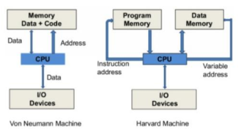
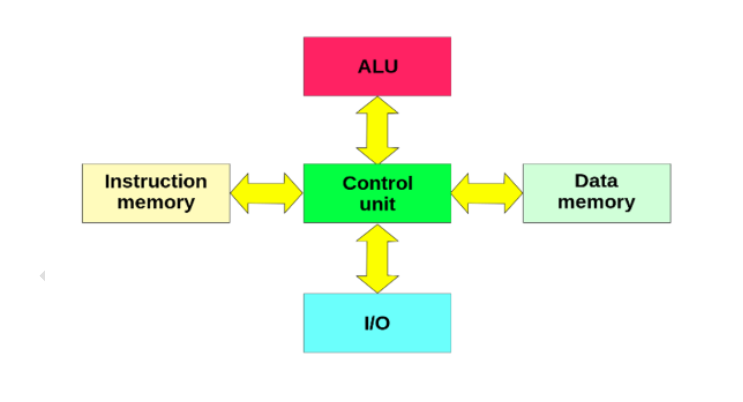
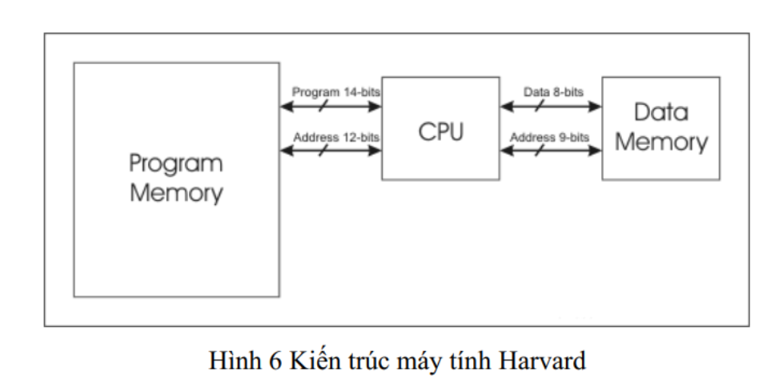
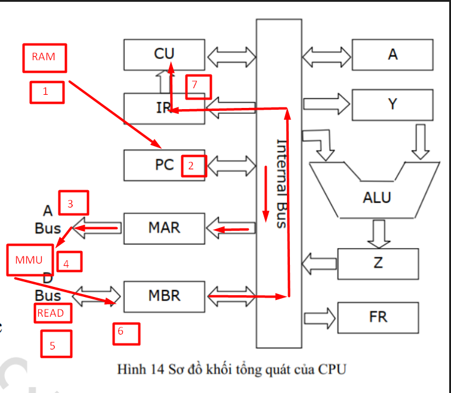

# TÌM HIỂU COMPUTER ARCHITECTURE

## I. TỔNG QUAN VỀ KIẾN TRÚC MÁY TÍNH

### 1. Khái niệm về kiến trúc máy tính

- Kiến trúc máy tính (Computer Architecture): là khoa học về lựa chọn và kết nối các thành phần cứng của máy tính nhằm đạt yêu cầu :

  - Hiệu năng: nhanh, tốt, đạt tốc độ xử lí cao
  - Chức năng: đáp ứng nhiều chức năng
  - Giá thành:  rẻ và tốt

### 2. Sơ đồ khối chức năng các thành phần trong máy tính

- Kiến trúc máy tính thường cơ bản được chia làm 4 khối hệ thống chứa năng chính, chỉ có tuỳ loại máy tính muốn tối ưu có thể bỏ vài khối thành phần không cần thiết.

Trong đó:

- **Bộ xử lí trung tâm (CPU)**:
  
  - Chức năng:

    - Đọc lệnh từ bộ nhớ
    - Giải mã và thực hiện lệnh

  - Bao gồm:

    - **Khối điều khiển (CU:Control Unit)**: Đọc, giải mã và điều khiển quá trình thực hiện lệnh.
    - **Khối tính toán số học và logic (ALU:Arithmetic and Logic Unit)**: Thực hiện các phép toán số học, phép toán logic
    - **Các thanh ghi(Registers):** Kho lệnh tạm thời chờ CPU xử lí
    - **Bus trong CPU**: Truyền dẫn các tín hiệu giữa các bộ phận trong CPU và kết nối hệ thống Bus ngoài

- **Bộ nhớ trong (Memory Unit)**:

  - Chức năng:

    - Lưu trữ lệnh và dữ liệu để CPU xử lí

  - Bao gồm:

    - **ROM - Read Only Memory**:

      - Lưu trữ dữ liệu lệnh và dữ liệu của hệ thống
      - Thông tin trong ROM được nạp từ khi sản xuất và thường chỉ có thể đọc trong quá trình sử dụng
      - Thông tin trong ROM vẫn tồn tại khi mất nguồn nuôi

    - **RAM - Random Access Memory**:

      - Lưu trữ lệnh và dữ liệu của hệ thống và người dùng
      - RAM thường có dung lượng lớn hơn nhiều so với ROM
      - Thông tin RAM thường sẽ mất đi sau khi mất nguồn nuôi

- **Các thiết bị vào/ra (I/O Devices)**:

  - **Thiết bị vào - Inputs Devices**: Nhập dữ liệu và điều khiển hệ thống và kết luận dữ liệu xuất ra

    - Bàn phím
    - Chuột
    - Ổ đĩa
  - **Thiết bị ra - Outputs Devices**: Kết xuất dữ liệu

    - Máy in
    - Ổ đĩa
    - Màn hình

- **Bus hệ thống**:

  - Tập hợp đường dây kết nối CPU với các thành phần khác máy tính
  - Bao gồm ba loại:

    - **Address Bus(Bus A)**: Truyền data from CPU to Memory Unit and I/O Device
    - **Data Bus(Bus D)**: Vận chuyển dữ liệu theo hai chiều đi và đến CPU
    - **Control Bus(Bus C)**: truyền tín hiệu control từ CPU to other unit, đồng thời truyền tín hiệu trạng thái của các thành phấn khác đến CPU

  
### 3. Các kiểu Computer Architecture

#### Kiến trúc Von-Neuman

Đặc điểm tiêu biểu của kiến trúc này :

- Dữ liệu và lệnh được lưu trong một bộ nhớ đọc/viết chia sẻ - một bộ nhớ duy nhất được sử dụng để lưu trữ cả lệnh và dữ liệu(**chưa có khái niệm RAM**)

- Bộ nhớ được đánh địa chỉ dựa trên đoạn và không phụ thuộc vào nội dung nó lưu trữ

- Các lệnh của chương trình chạy lần lượt (**chưa có chức năng đa nhiệm**)

- Quá trình thực hiện lệnh được chia thành 3 giai đoạn chính:

  (1) CPU đọc (`fetch`) lệnh từ bộ nhớ;  
  (2) CPU giải mã và thực hiện lệnh, nếu lệnh yêu cầu dữ liệu, CPU đọc dữ liệu từ bộ nhớ;  
  (3) CPU ghi kết quả thực hiện lệnh vào bộ nhớ.  

- Hạn chế: Bộ nhớ và lệnh dữ liệu (cổ chai) không được truy cập cùng lúc lên thông lượng nhỏ(**throughtput**) hơn nhiều so với tốc độ CPU có thể làm việc.

- Cách Khắc phục: **Dùng bộ nhớ cache** giữa **CPU** và **mainmemory**(Khắc phục được điểm yếu kiến trúc Von-Neuman)

- Bố nhớ được chia thành 2 phần:

  - Bộ nhớ chương trình
  - Bộ nhớ dữ liệu

- CPU sử dụng 2 bus hệ thống để liên hệ với bộ nhớ:

  - CPU có thể đọc lệnh và truy cập dữ liệu bộ nhớ cùng 1 lúc
  - Một bus A,D cho bộ nhớ chương trình và 1 bus A,D cho bộ nhớ dữ liệu (khác nhau về định dạng)

#### Kiến trúc Harvard

Đặc điểm của kiến trúc này:

- Chia bộ nhớ thành 2 phần riêng:

  - Bộ nhớ lưu chương trình
  - Bộ nhớ lưu dữ liệu

- Truyền nhanh vì quy trình đọc lệnh không tranh chấp
- Hỗ trợ nhiều truy cập đọc,viết bộ nhớ cùng lúc lên giảm xung đột truy cập bộ nhớ (đặc biệt khi CPU sử dụng kỹ thuật đường ống - pipeline)
- Ngày nay kiến trúc Harvard được cải tiến, ứng dụng cho nhiều kiến trúc máy tính hiện đại: ARM, Intelx86.
- Kiến trúc Harvard cũng được ứng dụng ở các hệ thống nhúng embed - ded system, chip chuyên xử lí tín hiệu (DSP).

=>  Dù thế cấu trúc chính của **máy tính laptop** vẫn **tuân thủ theo kiến trúc Von Neumann hiện đại**.

So sánh 3 kiểu kiến trúc mt: Harvard, Von Neumann cổ điển và hiện đại:

| Tiêu chí | Von Neumann cổ điển | Von Neumann hiện đại | Harvard |
|-----------|---------------------|----------------------|----------|
| Bộ nhớ | Chung instruction + data | Chung (nhưng có cache tách) | Tách riêng instruction & data |
| Bus | 1 bus chung | Nhiều bus nội bộ + cache | 2 bus riêng biệt |
| Bottleneck | Có (Von Neumann bottleneck - nút cổ chai) | Giảm mạnh nhờ cache | Không có |
| Hiệu năng | Thấp | Rất cao (PC/Server hiện nay) | Cao, ổn định |
| Thực tế sử dụng | Lý thuyết nền tảng | CPU như Intel, AMD | MCU, Embedded |

## II. TÌM HIỂU CÁC COMPONENTS CHÍNH

### 1. CPU (Central Processing Unit)

#### a.Sơ đồ khối tổng quát của CPU

Trong đó:

- **CU**: (Control Unit) Khối điều khiển
- **IR**: (Instruction) Thanh ghi lệnh
- **PC**: (Program Counter) Bộ đếm chương trình
- **MAR**: (Memory Address Register) Thanh ghi địa chỉ bộ nhớ
- **MBR**: (Memory Buffer Register) Thanh ghi nhớ đệm
- **A**: (Accumulator Register) Thanh ghi tích luỹ
- **Y,Z**: (Temporary Register) Thanh ghi nhớ đệm
- **FR**: (Flag Temporary) Thanh ghi cờ
- **ALU**: (Arithemic and Logic Unit): Khối tính toán số học Logic

#### b. Chu kì xử lý lệnh của CPU

**Chu kỳ lệnh (Instruction Cycle)** là khoảng thời gian để CPU thực hiện xong 1 lệnh kể từ khi CPU cấp phát tín hiệu địa chỉ ô nhớ tín hiệu địa chỉ ô nhớ chứa lệnh đến khi nó hoàn tất việc thực hiện lệnh đó.

Mỗi chu kì lệnh của CPU được mô tả theo bước sau:

1. Khi 1 chương trình được chạy, hệ điều hành tải mã chương trình vào bộ nhớ trong `RAM`
2. Địa chỉ lệnh đầu tiên của chương trình được đưa vào thanh ghi `PC`
3. Địa chỉ của ô nhớ chứa lệnh được chuyển tới **bus A** qua thanh ghi `MAR`
4. **Bus A** truyền địa chỉ tới **khối quản lý bộ nhớ MMU (Memory Man- agement Unit)**
5. **MMU** chọn ô nhớ và sinh ra tín hiệu `READ`
6. Lệnh chứa trong ô nhớ được chuyển tới thanh ghi `MBR` qua **bus D**.
7. `MBR` chuyển lệnh tới thanh ghi `IR`. Sau đó `IR` chuyển lệnh tới `CU`.
8. `CU` giải mã lệnh và sinh ra các tín hiệu xử lí cho các đơn vị khác(VD:`ALU` sẽ thực hiện lệnh cộng)
9. Địa chỉ trong PC được tăng lên để trỏ tới lệnh tiếp theo của chương trình sẽ được thực hiện
10. Thực hiện lại các bước 3 -> 9 để chạy hết các lệnh của chương trình

