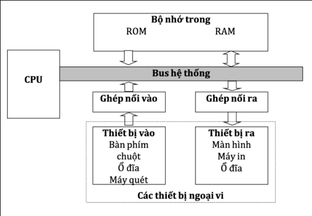
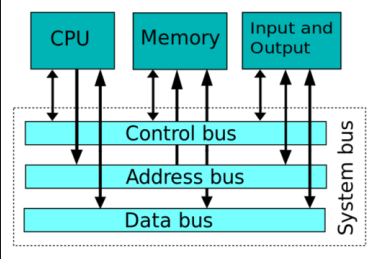

# TÌM HIỂU COMPUTER ARCHITECTURE

## I. TỔNG QUAN VỀ KIẾN TRÚC MÁY TÍNH

### 1. Khái niệm về kiến trúc máy tính

- Kiến trúc máy tính (Computer Architecture): là khoa học về lựa chọn và kết nối các thành phần cứng của máy tính nhằm đạt yêu cầu :

  - Hiệu năng: nhanh, tốt, đạt tốc độ xử lí cao
  - Chức năng: đáp ứng nhiều chức năng
  - Giá thành:  rẻ và tốt

### 2. Sơ đồ khối chức năng các thành phần trong máy tính

- Kiến trúc máy tính thường cơ bản được chia làm 4 khối hệ thống chứa năng chính, chỉ có tuỳ loại máy tính muốn tối ưu có thể bỏ vài khối thành phần không cần thiết.

Trong đó:

- **Bộ xử lí trung tâm (CPU)**:
  
  - Chức năng:

    - Đọc lệnh từ bộ nhớ
    - Giải mã và thực hiện lệnh

  - Bao gồm:

    - **Khối điều khiển (CU:Control Unit)**: Đọc, giải mã và điều khiển quá trình thực hiện lệnh.
    - **Khối tính toán số học và logic (ALU:Arithmetic and Logic Unit)**: Thực hiện các phép toán số học, phép toán logic
    - **Các thanh ghi(Registers):** Kho lệnh tạm thời chờ CPU xử lí
    - **Bus trong CPU**: Truyền dẫn các tín hiệu giữa các bộ phận trong CPU và kết nối hệ thống Bus ngoài

- **Bộ nhớ trong (Memory Unit)**:

  - Chức năng:

    - Lưu trữ lệnh và dữ liệu để CPU xử lí

  - Bao gồm:

    - **ROM - Read Only Memory**:

      - Lưu trữ dữ liệu lệnh và dữ liệu của hệ thống
      - Thông tin trong ROM được nạp từ khi sản xuất và thường chỉ có thể đọc trong quá trình sử dụng
      - Thông tin trong ROM vẫn tồn tại khi mất nguồn nuôi

    - **RAM - Random Access Memory**:

      - Lưu trữ lệnh và dữ liệu của hệ thống và người dùng
      - RAM thường có dung lượng lớn hơn nhiều so với ROM
      - Thông tin RAM thường sẽ mất đi sau khi mất nguồn nuôi

- **Các thiết bị vào/ra (I/O Devices)**:

  - **Thiết bị vào - Inputs Devices**: Nhập dữ liệu và điều khiển hệ thống và kết luận dữ liệu xuất ra

    - Bàn phím
    - Chuột
    - Ổ đĩa
  - **Thiết bị ra - Outputs Devices**: Kết xuất dữ liệu

    - Máy in
    - Ổ đĩa
    - Màn hình

- **Bus hệ thống**:

  - Tập hợp đường dây kết nối CPU với các thành phần khác máy tính
  - Bao gồm ba loại:

    - **Address Bus(Bus A)**: Truyền data from CPU to Memory Unit and I/O Device
    - **Data Bus(Bus D)**: Vận chuyển dữ liệu theo hai chiều đi và đến CPU
    - **Control Bus(Bus C)**: truyền tín hiệu control từ CPU to other unit, đồng thời truyền tín hiệu trạng thái của các thành phấn khác đến CPU

  
### Các kiểu Computer Architecture