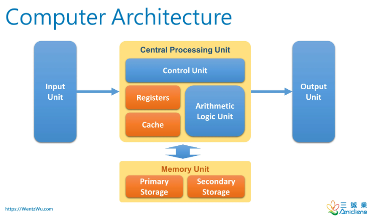

# TO DO TASK

## DESCRIPTION

### I. Giai đoạn 1: Tìm hiểu về kiến trúc máy tính (Computer Architecture)

#### 1. Tìm hiểu cấu trúc cơ bản nhất của 1 máy tính cần có ?

- Tìm hiểu khái niệm, Cơ chế hoạt động, Đặc điểm, Các Loại,... kiến trúc máy tính ?
- Tìm hiểu **5 thành phần chính** của máy tính (`CPU`, `Memory`, `Storage`, `I/O` and `Bus System`)
- Tìm hiểu về **Binary** & **Assembly** & **UTF** (Có bao loại UTF).Tìm hiểu rõ từng cái một ?
- Tìm hiểu **Register**, **Cache**, **Cluster** ?
- Tìm hiểu **ALU**, **CLU**, **BIOS/UEFI**, **Boot process** or **Boot Loader** là gì ?
- Tìm hiểu detail **Nguyên lí hoạt động** của 1 máy tính (Chu trình loop: `Fetch`->`Decode`->`Excute`->`Repeat`)
- Liệt kê I/O Devices
- Tìm hiểu & So sánh **Firmware** vs **Kernel** vs **OS** ?
- Tìm hiểu về đơn vị **GHz**, Công nghê sản xuất Chip hiện nay ?
- So sánh **CPU** & **GPU** & TPU ...

#### 2. Lab (Thực hành)

- Cài Linux từ USB và xem Log khởi động (`dmesg`)
- Dùng `lscpu`, `lsblk`, `lspci` để hiểu phần cứng
- Viết một chương trình `Asembly` nhỏ đẻ theo tác với CPU Register

#### 3. Tìm hiểu sơ qua về máy tính train AI or GPU train AI

- Ví dụ: Siêu máy tính DGX-2 của NVDIA là máy tính thiết kế tối ưu dành cho việc huấn luyện các mô hình AI và các mô hình LLM (Ngôn ngữ lớn) dành cho GROK của tỷ phú Elon Musk or GPT của Open AI.

=> **Mục tiêu**: Biết được kiến trúc 1 máy tính cấu tạo ra sao

### II.Giải đoạn 2: Tìm hiểu OS - Hệ điều hành (Operating System)

- Tìm hiểu chung OS là gì ?
- Tìm hiểu về 2 OS phổ biến nhất hiện nay là : Window, Linux ?
- Tìm hiểu các Distro trong Linux (Ubuntu,CentOS,Rocky,...)
- Tìm hiểu và vận hành OS ở mức độ `Junior`:

  - Lệnh cơ bản: `ls`, `cd`, `chmod`, `chown`, `ps`, `top`, `grep`, `awk`, `sed`
  - Cấu trúc thư mục Linux (/`etc`, `/var`, `/home`, `/usr`)
  - Quyền `user`, `group`, `sudo` hay **permission**
  - Dịch vụ (service), process, log system

- Tìm hiểu & thực hành debug OS and optimize container và pipeline CI/CD ở cấp `Middle - level`:

  - Tìm hiểu **Process scheduling**:Hiểu CPU time, load average, context switch ?
  - Tìm hiểu **Memory management**: Cache, swap, virtual memory, OOM killer ?
  - Tìm hiểu **File system internals**: Inode, journaling, disk I/O, iostat, df, du ?
  - Tìm hiểu **System calls & Kernel space**: Biết cách đọc syscall qua strace ?
  - Tìm hiểu **System performance tuning**: ulimit, sysctl, vm.swappiness, nice, cgroups ?
  - Tìm hiểu **Init process & Boot flow**: Từ BIOS → kernel → systemd → service ?
  - Tìm hiểu **Networking stack**: Socket, TCP connection state, net namespace ?
  - Tìm hiểu **Container isolation** (namespace, cgroups): Hiểu cách Docker cô lập tiến trình ?
  - Thực hành theo dõi tài nguyên bằng `top`, `vmstat`, `iotop`, `sar`, `pidstat`.
  - Thực hành **Debug app** chết do **OOM hoặc CPU spike**.
  - Thực hành **Điều chỉnh kernel param** để tăng performance.
  - Thực hành Hiểu vì sao container chạy “như process”.

- Tìm hiểu & Thực hành để touch core Kernel and deep optimize trong môi trường Cloud lớn

  - Tìm hiểu **Kernel tuning sâu**: Để hiểu CPU governor; NUMA; hugepage; IRQ affinity ?
  - Tìm hiểu **eBPF & tracing**: Để theo dõi kernel runtime, network tracing ?
  - Tìm hiểu **Scheduler & cgroups v2**: Để tối ưu container scheduling ?
  - Tìm hiểu **Security model**: Để SELinux, AppArmor, capabilities ?
  - Tìm hiểu **Custom kernel build**:Để biết build hoặc patch kernel nếu cần (hiếm) ?
  - Thực hành **Debug lỗi kernel panic** trong production.
  - Thực hành theo dõi **container và network** ở mức `kernel`.
  - Thực hành làm việc với **team kernel hoặc infra core**.

=> **Mục tiêu**:

- Tự deploy app trên Linux server.
- Tự xử lý khi web hoặc service chết.
- Đọc log để tìm nguyên nhân.
- Biết vì sao hệ thống **chậm**, không chỉ biết **restart** lại là xong.
- Có thể tối ưu **máy chủ**, **container**, **và pipeline CI/CD** ở cấp OS.

### III. Giai đoạn 3: Tìm hiểu về Command Line (`Bash`,`Shell`,..?)

#### 1. Tìm hiểu & Lab ở mức độ `Basic Level`

- `cd`, `ls`, `mv`, `cp`, `rm`
- `cat`, `less`, `head`, `tail`
- `mkdir`, `chmod`, `chown`
- `systemctl start/stop/restart`
- `apt/yum/dnf install`
- `ssh`, `scp`
- `nano`, `vim` (ít nhất biết mở & lưu)

#### 2. Tìm hiểu & Lab ở mức độ `Middle Level`

- Quản lí file & text:

  - `grep` nâng cao (regex)
  - `find` + `exec`
  - `sed` (replace text)
  - `awk` (xử lý text column-based)

- Quyền hạn & User:

  - `useradd`, `passwd`
  - `su`, `sudoers`
  - `sticky bit`, `setuid`, `setgid`

- Quản lý process

  - `ps -ef`
  - `top`, `htop`
  - `kill`, `pkill`
  - `nice`, `renice`

- Networking

  - `ifconfig` / `ip addr`
  - `ip route`
  - `ping`, `traceroute`, `dig`, `nslookup`
  - `netstat` / `ss`
  - `curl`, `wget`

- Nén – đóng gói

  - `tar`, `gz`, `zip`, `unzip`
  - `rsync`

#### 3. Tìm hiểu ở mức `Senior -Level`

- Shell scripting (bắt buộc giỏi)

  - biến (variables)
  - function
  - pipe, redirection
  - subshell
  - arrays
  - error handling (`set -e`, `trap`)
  - logging
  - cron jobs automation

- Performance & troubleshooting

  - đọc log hệ thống: `journalctl`
  - phân tích memory: `free`, `vmstat`, `/proc/meminfo`
  - phân tích CPU: `mpstat`, `sar`
  - phân tích I/O: `iostat`
  - phân tích network: `tcpdump`, `ngrep`

- Filesystem & Disk management

  - `mount`, `umount`
  - ext4/xfs/btrfs basics
  - `lsof`
  - `df`, `du`
  - LVM (`pvcreate`, `vgcreate`, `lvcreate`)
  
#### 4. Tìm hiểu và Lab ở mức `Lead - Level`

- `Automation`

  - **viết script** tự **deploy app**
  - **script backup/restore**
  - **script monitor service**
  - **script auto restart khi service chết**

- Tích hợp với DevOps tools

  - Command line mày sẽ dùng để thao tác:

    - `Docker CLI`
    - `Kubernetes CLI` (kubectl)
    - `Git CLI`
    - `Terraform CLI`
    - `Ansible CLI`
  
  => Mục tiêu: mức **admin hệ thống** + **scripting** + **troubleshooting**.

  - DevOps = 70% command line + 30% tool GUI.

### IV. Tìm hiểu về Netwworking (CCNA + ≈CCNP)

#### 1. Tìm hiểu CCNA ?

- Tìm hiểu tất cả kiến thức có trong CNNA và Lab thực hành All các dạng bài trong **Cisco Tracket Pacer**

#### 2. Tìm hiểu CCNP ?

- IP routing core (vừa đủ)

  - **Static route**
  - **OSPF** basic
  - **BGP** khái niệm + cách hoạt động
  - **Không cần học full CCNP** routing như **redistribution, route reflector, complex topology**.

- Network troubleshooting

  - Traceroute / mtr
  - Path MTU
  - Packet flow
  - Tcpdump
  - Firewall rules logic
  - TCP handshake
  - Latency, jitter, drops

- Load balancing concepts

  - L4 vs L7
  - NAT, PAT
  - DNAT / SNAT
  - TCP vs UDP
  - Session persistence

- Network security basic

  - ACL logic
  - Firewall concept
  - VLAN segmentation
  - VPN basic (IPSec)

- IPv6 basic

  - Trong cloud (AWS, Azure, GCP) rất hay gặp IPv6.

- **Lưu ý**: không tìm hiểu quá kĩ những phần sau (Có thể đọc hiểu nếu muốn):

  - EIGRP full
  - OSPF multi-area phức tạp
  - MPLS
  - DMVPN
  - QoS chi tiết theo từng DSCP
  - Wireless
  - Switching sâu (STP, RSTP, MSTP)

=> Mục tiêu: DevOps cần networking mức “hiểu để vận hành hệ thống lớn + debug sự cố nhanh”.
